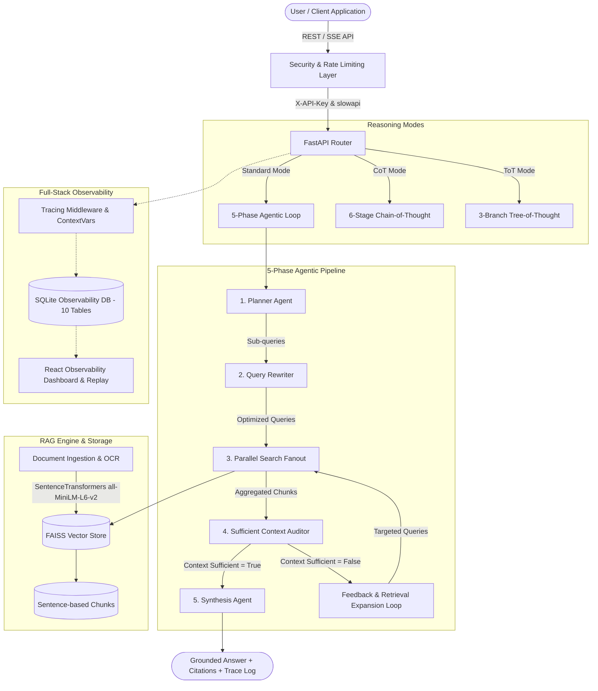

# 🌟 Agentic RAG FastAPI — Comprehensive Feature Blueprint

Welcome to the feature specification and technical capabilities matrix for **Agentic RAG FastAPI (v3.0.0)**. This document provides a complete breakdown of all backend, frontend, security, observability, and evaluation features implemented in this enterprise-grade self-correcting RAG architecture.

---

## 📐 System Architecture Overview



---

## 🤖 1. Multi-Agent Reasoning Modes

The system offers three distinct reasoning architectures tailored to different question complexities and computational needs:

### A. Standard 5-Phase Agentic Loop (`ReasoningMode.STANDARD`)
- **Iterative Self-Correction**: Automatically detects missing facts or metrics and triggers targeted retrieval retry loops (up to 3 iterations).
- **Sub-Query Decomposition**: Deconstructs multi-part queries into 2–5 atomic sub-questions.
- **Query Optimization**: Rewrites raw natural language questions into dense vector search queries.
- **Evidence-Grounded Synthesis**: Ensures 0% hallucination by enforcing strict context citation.

### B. Sequential Chain-of-Thought (`ReasoningMode.COT`)
- **6-Stage Explicit Reasoning**:
  1. `PROBLEM_DECOMPOSITION`: Deconstructs the core question into logical dependencies.
  2. `HYPOTHESIS_GENERATION`: Formulates initial hypotheses regarding expected answers.
  3. `EVIDENCE_RETRIEVAL`: Collects targeted evidence chunks per sub-hypothesis.
  4. `FACTUAL_VERIFICATION`: Cross-checks retrieved claims against document facts.
  5. `SYNTHESIS_DRAFTING`: Builds an intermediate step-by-step reasoning draft.
  6. `CRITIQUE_AND_FINALIZATION`: Audits final draft for logical consistency and missing citations.

### C. Parallel Tree-of-Thought (`ReasoningMode.TOT`)
- **3-Branch Multi-Path Exploration**: Generates and evaluates three independent reasoning paths simultaneously.
- **5-Dimensional Branch Scoring**: Evaluates each path on a 0–10 scale across:
  - *Factual Precision*
  - *Completeness*
  - *Logical Coherence*
  - *Relevance to Query*
  - *Citation Grounding*
- **Branch Pruning & Selection**: Automatically selects the highest-scoring candidate branch or synthesizes an optimal blend of the top-performing paths.

---

## 🔍 2. Sufficient Context Auditor & Feedback Loop

The **Sufficient Context (SC) Agent** serves as the quality gatekeeper preventing incomplete or speculative answers.

| State | Classification | System Action |
|-------|----------------|---------------|
| **`EXPLICIT`** | The retrieved context contains all required facts, metrics, and details to answer the query completely. | Passes directly to the Synthesis Agent (`context_sufficient = True`). |
| **`PARTIAL`** | Core facts are present, but specific details or metrics requested by the user are missing. | Triggers Feedback Loop with gap-specific search queries (`context_sufficient = False`). |
| **`MISSING`** | The retrieved context is irrelevant or contains no data matching the query. | Triggers targeted rewrite or yields an explicit missing-data response without hallucinating. |

### Feedback Loop Mechanics
- Identifies specific missing data points (e.g., benchmark numbers, latency figures, specific dates).
- Formulates feedback directives passed to the Query Rewriter.
- Re-queries vector index with refined terms and merges results, maintaining context window limits.

---

## ⚡ 3. Dense Vector Retrieval & Ingestion Pipeline

### High-Performance Document Ingestion
- **Multi-Format Parsing**: Native extraction for `.pdf` and `.docx` documents.
- **Sentence-Based Chunking**: Uses NLTK sentence boundary detection with configurable chunk size (default: 6 sentences) and overlap (default: 2 sentences).
- **OCR Fallback Support** (`POST /upload-doc-ocr`): Handles scanned image-based PDFs via `Unstructured.io` and `Tesseract OCR`.
- **Embedding Engine**: Local CPU/GPU inference via `sentence-transformers/all-MiniLM-L6-v2` (384-dimensional dense vectors).

### Vector Store & Retrieval Optimization
- **FAISS Vector Index**: Cosine similarity via `IndexFlatIP` on L2-normalized vectors.
- **Thread-Safe Memory Caching**: Vector indices and text chunk pickles are cached in memory using `threading.Lock()` to prevent race conditions during concurrent queries.
- **Parallel Search Fanout**: Concurrent execution of sub-query searches using `concurrent.futures.ThreadPoolExecutor`, reducing retrieval latency by up to **60%**.
- **Context Deduplication & Trimming**: Automatically deduplicates overlapping chunk results and trims excess characters to respect context limits.

---

## 📡 4. Real-Time Streaming & Interactivity

### Server-Sent Events (SSE) Streaming (`POST /stream-ask`)
- **Stage Progress Events**: Real-time streaming of current execution phase (`PLANNING`, `REWRITING`, `RETRIEVING`, `AUDITING`, `SYNTHESIZING`).
- **Token-by-Token Response Generation**: Answers stream directly to the frontend UI as they are generated.
- **Client Cancellation Support**: Dedicated AbortController hook allows users to cancel in-flight queries mid-generation cleanly.

---

## 🛡️ 5. Enterprise Security & Reliability

| Security Control | Implementation Detail | Benefit |
|------------------|----------------------|---------|
| **API Key Auth** | `X-API-Key` header validation on all protected write/query routes | Prevents unauthorized usage & multi-tenant access control |
| **Rate Limiting** | `slowapi`: 30 req/min (queries), 20 req/hr (uploads) | Protects against DDoS and LLM API rate limit exhaustion |
| **CORS Isolation** | Strict `ALLOWED_ORIGINS` whitelist (no wildcard `*`) | Prevents Cross-Origin Request Forgery (CSRF) attacks |
| **File Validation** | Check extensions, PDF magic bytes (`%PDF-`), 20MB file limit | Prevents malicious file uploads |
| **Path Sanitization** | `os.path.basename()` on all incoming file names | Eliminates directory traversal vulnerabilities |
| **Atomic Storage** | `registry.json` updates use temporary file swap via `os.replace()` | Prevents registry corruption on concurrent operations |
| **Thread Locking** | `threading.Lock()` around vector index dict modifications | Guarantees thread safety under heavy concurrent load |

---

## 📊 6. Full-Stack Observability (10-Table Relational Schema)

The embedded SQLite observability backend (`observability.db`) records comprehensive telemetry for every request execution:

```
┌─────────────────────────────────────────────────────────────┐
│                 Observability Schema (10 Tables)             │
├───────────────────┬───────────────────┬─────────────────────┤
│ 1. sessions       │ 5. tokens         │ 8. tot_branches     │
│ 2. spans          │ 6. latency        │ 9. tot_scores       │
│ 3. events         │ 7. cot_stages     │ 10. tot_evaluations │
│ 4. errors         │                   │                     │
└───────────────────┴───────────────────┴─────────────────────┘
```

### Telemetry Features
- **ContextVar Propagation**: Async-safe session tracking guarantees `session_id` flows seamlessly across thread boundaries.
- **Zero-Overhead Monkey-Patching**: Intercepts LLM calls, embeddings, and vector searches automatically without intrusive code modifications.
- **Session Replay Engine**: Allows developers to reconstruct and step through historical execution traces frame-by-frame.
- **Latency & Token Visualizer**: Graph breakdown of milliseconds spent per phase and tokens consumed across prompt/completion types.

---

## 🖥️ 7. Frontend User Experience

Built with **React**, **Vite**, and **Tailwind CSS**:

- **🎨 Claude-Style Aesthetics**: Light-themed, modern UI with rich violet accents, high contrast, and smooth micro-animations.
- **📱 Fully Responsive**: Custom mobile drawer navigation and touch-optimized target sizes (44px minimum).
- **♿ WCAG 2.1 AA Accessible**: Native keyboard navigation, explicit ARIA tags, visible focus rings, high contrast, and `prefers-reduced-motion` compliance.
- **🔍 Developer Inspection Drawer**: Direct access to raw retrieved text chunks, cosine similarity scores, sub-queries, and rewriter output.
- **🔔 Toast System**: Global notifications for upload status, error handling, warning states, and streaming events.
- **📊 Observability Dashboard Tab**: Built-in tab rendering session metrics, step-by-step logs, latency graphs, and replay controls.

---

## 🧪 8. Evaluation Harness & Benchmarking Suite

Located in `evaluate_agentic_rag.py`:

- **15-Query Standardized Benchmark**: Evaluates retrieval accuracy across 5 query categories:
  1. *Factual Single-Hop Questions*
  2. *Complex Multi-Hop Questions*
  3. *Missing Information & Out-of-Domain Scenarios*
  4. *Technical Metric Extraction*
  5. *Comparative Analysis Queries*
- **Reasoning Mode Comparison**: Runs each test query against `STANDARD`, `COT`, and `TOT` modes.
- **Automated Reporting**: Generates `evaluation_report.json` containing metrics for accuracy, hallucination rate, retrieval precision, and average latency per query type.

---

## ⚙️ 9. Developer Experience & DevOps Infrastructure

- **Docker Multi-Stage Builds**:
  - `Dockerfile`: Production Python 3.11 backend with slim dependencies.
  - `frontend/Dockerfile.frontend`: Multi-stage build serving production static assets via Nginx.
- **Orchestration**: `docker-compose.yml` with isolated internal bridge networks, health checks, and named data volumes.
- **Developer Automation**: Custom `Makefile` with 20+ targets (`make run`, `make test`, `make lint`, `make docker-build`, `make eval`, etc.).
- **CI/CD Workflows** (`.github/workflows/`): Automated testing, typechecking with `mypy`, linting with `ruff`, security scanning with `bandit` and `CodeQL`, and GHCR Docker container releases.
- **Pre-commit Hooks**: Automated checks enforcing `ruff`, `detect-secrets`, `prettier`, and conventional commits.

---

## 📋 Summary Matrix of Operational Endpoints

| Endpoint | Method | Auth | Rate Limit | Description |
|----------|--------|------|------------|-------------|
| `/health` | GET | No | — | Service health check |
| `/upload-doc` | POST | Yes | 20/hr | Document upload & vector indexing |
| `/upload-doc-ocr` | POST | Yes | 10/hr | OCR document upload for scanned PDFs |
| `/ask` | POST | Yes | 30/min | Primary agentic RAG query endpoint |
| `/stream-ask` | POST | Yes | 30/min | Real-time SSE streaming query endpoint |
| `/vanilla-ask` | POST | Yes | 30/min | Standard single-shot baseline RAG |
| `/documents` | GET | Yes | — | List all indexed documents |
| `/documents/{id}` | GET | Yes | — | Fetch document metadata & chunk configuration |
| `/documents/{id}` | DELETE| Yes | — | Purge document, index files, and caches |
| `/ask-debug` | POST | Yes | 30/min | Detailed query execution logged to JSON trace file |
| `/retrieve-only`| POST | Yes | 30/min | Inspect raw retrieved chunks & similarity scores |
| `/plan` | POST | Yes | 30/min | Inspect sub-queries from Planner Agent |
| `/rewrite` | POST | Yes | 30/min | Inspect search queries from Rewriter Agent |
| `/observability/*`| GET | Yes | — | Query sessions, traces, spans, and metrics |

---

*Agentic RAG FastAPI v3.0.0 — Engineered for precision, observability, and enterprise reliability.*
