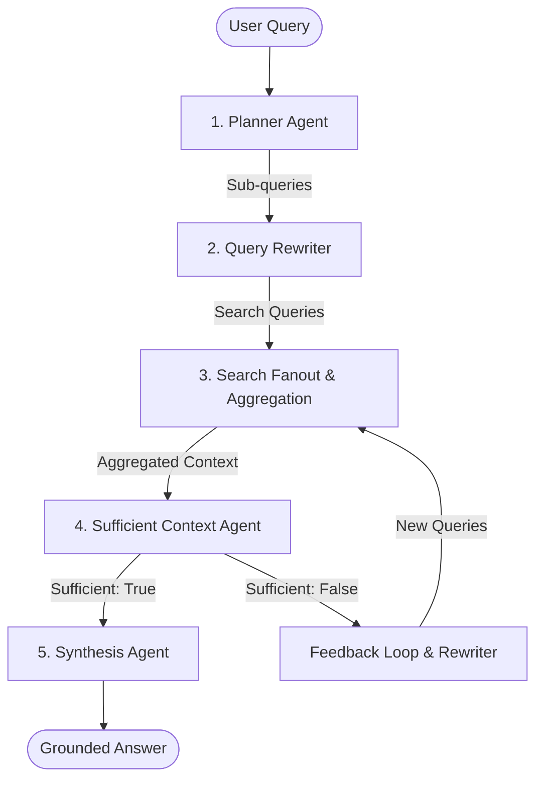

# Enterprise Agentic RAG Platform: Developer Handbook & Technical Manual

> 📖 For a detailed technical specification of all system capabilities, see [FEATURES.md](file:///d:/Gemini%20ai%20agentic%20rag/FEATURES.md).

Welcome to the comprehensive technical documentation for the **Enterprise Agentic Retrieval-Augmented Generation (Agentic RAG) Platform**. This document serves as an end-to-end handbook for systems architects, backend developers, frontend engineers, and operators to understand, run, debug, and expand the platform.

---

## Table of Contents
1.  [System Overview & Cognitive RAG Principles](#1-system-overview--cognitive-rag-principles)
2.  [The 5-Phase Agentic Execution Pipeline](#2-the-5-phase-agentic-execution-pipeline)
    - [Phase 1: Planner Agent](#phase-1-planner-agent)
    - [Phase 2: Query Rewriter Agent](#phase-2-query-rewriter-agent)
    - [Phase 3: Concurrent Search Fanout & Deduplication](#phase-3-concurrent-search-fanout--deduplication)
    - [Phase 4: Context Sufficiency Auditing](#phase-4-context-sufficiency-auditing)
    - [Phase 5: Synthesis Agent](#phase-5-synthesis-agent)
3.  [Advanced Reasoning Workflows](#3-advanced-reasoning-workflows)
    - [Chain of Thought (CoT) Reasoner](#chain-of-thought-cot-reasoner)
    - [Tree of Thought (ToT) Reasoner](#tree-of-thought-tot-reasoner)
4.  [Repository Directory Structure](#4-repository-directory-structure)
5.  [Observability Storage & Database Schema](#5-observability-storage--database-schema)
6.  [Observability Instrumentation & Monkey-Patching](#6-observability-instrumentation--monkey-patching)
7.  [REST API Endpoint Catalog](#7-rest-api-endpoint-catalog)
8.  [Frontend Component Architecture](#8-frontend-component-architecture)
9.  [Developer Setup & Installation](#9-developer-setup--installation)
10. [Automated Quality Assurance & Verification Suite](#10-automated-quality-assurance--verification-suite)

---

## 1. System Overview & Cognitive RAG Principles

Linear Retrieval-Augmented Generation architectures suffer from a critical limitation: **they are passive and linear**. In a standard RAG pipeline, a user query is converted into a vector embedding, searched against an index, and the retrieved chunks are packaged into a prompt for synthesis. If the vector search returns incomplete information, keyword-mismatched content, or general text lacking requested specific metrics (e.g., latency performance, precise percentages, or numerical metrics), the LLM synthesizes an incomplete, hallucinated, or general response.

This platform implements an **Agentic, self-correcting RAG** designed to run active decision loops. Instead of a single forward pass, the platform splits queries, evaluates the quality of retrieved contexts, and dynamically triggers follow-up retrievals if gaps are detected.

### Architectural Modes
The platform supports three distinct modes of reasoning:
1.  **Standard Agentic Loop**: A 5-phase loop that splits, rewrites, searches, checks for context sufficiency, and iterates up to $N$ times if the retrieved context is flagged as insufficient.
2.  **Chain of Thought (CoT) Reasoner**: A 6-stage linear pipeline that explicitly separates stages of cognitive planning: understanding query, identifying required information, planning retrieval, retrieving evidence, sufficiency verification, and synthesis.
3.  **Tree of Thought (ToT) Reasoner**: An evaluation-driven tree planner that spawns 3 parallel strategy branches, executes vector retrievals, scores the retrieved content across five metrics, and dynamically selects or merges the best branches to run the query.

---

## 2. The 5-Phase Agentic Execution Pipeline

The core execution loops rely on five distinct specialized agents collaborating to retrieve context and synthesize answers.



### Phase 1: Planner Agent
The Planner Agent is the entry gate. It decomposes a complex, multi-part user query into a JSON array of up to 5 focused sub-questions. 
*   **Source File**: `agents/planner.py`
*   **Prompt Template**:
    ```
    You are a Planner Agent in an Agentic RAG system.

    Break the user's query into 2 to 5 focused sub-questions that would help retrieve the required information.
    Return ONLY a valid JSON array of strings.
    Do not add any explanation.

    User Query: {query}
    ```

### Phase 2: Query Rewriter Agent
The Query Rewriter translates raw sub-questions into technical, dense-retrieval-friendly search queries optimized for embedding match similarity.
*   **Source File**: `agents/rewriter.py`
*   **Prompt Template**:
    ```
    You are a Query Rewriter for retrieval.

    Rewrite the following question into a concise search query optimized for semantic retrieval from a technical document.
    Return only the rewritten query and nothing else.

    Question: {sub_query}
    ```

### Phase 3: Concurrent Search Fanout & Deduplication
For each rewritten sub-query, the engine executes vector retrieval against a localized **FAISS** index.
*   **Vector Metric**: The vector store employs Cosine-like similarity using normalized SentenceTransformers (`all-MiniLM-L6-v2`) embeddings matched with `faiss.IndexFlatIP` (Flat Inner Product).
*   **Deduplication**: Chunks retrieved across different sub-queries are combined. Any duplicate text chunk is identified and skipped to conserve the LLM context window.
*   **Trimming**: The aggregated context is capped at a maximum of 12,000 characters before delivery to the sufficiency evaluator.

### Phase 4: Context Sufficiency Auditing
The Sufficient Context Agent evaluates the retrieved context and a preliminary intermediate draft against the user's initial query.
*   **Source File**: `agents/sufficient_context.py`
*   **Strict Rules**:
    1.  If the query asks for fact-specific metrics (e.g., latency, scores, numbers, dates) and those are not present in the context, it **must** set `is_context_sufficient = false`.
    2.  It distinguishes general topic coverage from explicit answers. General text without exact metrics triggers a rejection.
    3.  It sets `evidence_type` to:
        *   `explicit` (metric/facts present)
        *   `partial` (general topic present but metrics missing)
        *   `missing` (no relevant info)
*   **Prompt Template**:
    ```
    You are the Sufficient Context Agent in an Agentic RAG system.
    ...
    [Strict Rules listed above]
    ...
    The top-level response must be a JSON dictionary with these exact keys:
    - is_context_sufficient
    - missing_information
    - feedback_log
    - reasoning_summary
    - evidence_type
    
    USER QUERY: {query}
    RETRIEVED CONTEXT: {context}
    INTERMEDIATE DRAFT: {intermediate_draft}
    ```

### Phase 5: Synthesis Agent
Once context is verified as sufficient, the Synthesis Agent combines the user query and the validated context to draft the final response. It enforces a strict **zero-hallucination policy**—if the context does not contain the answer, it state it explicitly.
*   **Source File**: `agents/synthesis.py`
*   **Prompt Template**:
    ```
    You are the Synthesis Agent in an Agentic RAG system.

    Use ONLY the provided context to answer the user's question.
    Do not invent missing facts.
    If the context does not contain something, explicitly say so.

    USER QUERY: {query}
    CONTEXT: {context}
    ```

---

## 3. Advanced Reasoning Workflows

### Chain of Thought (CoT) Reasoner
The CoT pipeline (`agents/cot_reasoner.py`) runs a structured, linear reasoning workflow tracking 6 stages. Each stage is timed, summarized, and recorded in the database:

| Stage Index | Stage Name | Action Performed |
| :--- | :--- | :--- |
| **1** | Understand Query | Analyzes the core topic, implicit constraints, and subject area. |
| **2** | Identify Required Info | Lists critical factual points, details, or documentation segments. |
| **3** | Plan Strategy | Executes the Planner Agent to generate target sub-queries. |
| **4** | Retrieve Evidence | Translates, retrieves from FAISS, and aggregates context. |
| **5** | Evaluate Context Sufficiency | Assesses retrieved context against the stage-2 requirements. |
| **6** | Generate Grounded Answer | Calls Synthesis Agent to write the final citation-linked output. |

---

### Tree of Thought (ToT) Reasoner
The ToT engine (`agents/tree_of_thought.py`) evaluates multiple parallel search vectors before executing the final agentic loop:

1.  **Branch Generation**: Spawns 3 strategies:
    *   **Branch A (General Architecture)**: Broad system overview and layout concepts.
    *   **Branch B (Component-Specific)**: Granular modules, step processes, and micro-logic.
    *   **Branch C (Evidence-Oriented)**: Exact numerical metrics, latency, and benchmarks.
2.  **Retrieval Evaluation**: Sub-queries are retrieved for each branch. The retrieved chunks are passed to an LLM evaluator to score the branch $(S_i \in [0.0, 1.0])$ on:
    *   `coverage`: General query coverage.
    *   `completeness`: Practical use for drafting answers.
    *   `evidence_quality`: Concrete metrics/facts vs. vague concepts.
    *   `confidence`: Answerability of the query.
    *   `retrieval_similarity`: Derived from average FAISS L2 distance:
        $$S_{sim} = \max\left(0, 1 - \frac{Dist_{avg}}{2.0}\right)$$
3.  **Weighted Scoring**:
    $$Score = 0.15 \cdot S_{sim} + 0.25 \cdot S_{cov} + 0.20 \cdot S_{comp} + 0.20 \cdot S_{ev} + 0.20 \cdot S_{conf}$$
4.  **Branch Merging Rules**:
    *   Normally, the winning branch is selected for execution.
    *   If $Score(Branch_1) - Score(Branch_2) \le 0.15$ and both exceed $0.60$, their sub-queries are combined for a hybrid strategy:
        ```python
        merged_queries = list(set(branch_1["sub_queries"] + branch_2["sub_queries"]))
        ```

---

## 4. Repository Directory Structure

```
.
├── agentic_rag_fastapi/              # Backend FastAPI Service
│   ├── app.py                        # REST Gateway, configuration & routing setup
│   ├── schemas.py                    # Pydantic schema validation models
│   ├── evaluate_agentic_rag.py       # Automated evaluation benchmarking module
│   ├── requirements.txt              # Backend third-party requirements
│   ├── agents/                       # Cognitive multi-agent modules
│   │   ├── agentic_loop.py           # Orchestration controller (Standard/CoT/ToT)
│   │   ├── cot_reasoner.py           # 6-Stage CoT execution script
│   │   ├── tree_of_thought.py        # ToT candidate generator & scoring evaluator
│   │   ├── planner.py                # Decomposition agent
│   │   ├── rewriter.py               # Translation rewriter agent
│   │   ├── sufficient_context.py     # Sufficiency audit agent
│   │   ├── synthesis.py              # Consolidated answer writer
│   │   └── llm.py                    # Groq SDK llama-3.3-70b integration layer
│   ├── rag/                          # Data Ingestion & Search Indexing
│   │   ├── embeddings.py             # SentenceTransformers embedding generator (all-MiniLM-L6-v2)
│   │   ├── ingestion.py              # Document loaders (pypdf, docx)
│   │   ├── vector_store.py           # FAISS Index implementation & pickle cache manager
│   │   └── retrieval.py              # Query semantic retriever
│   ├── observability/                # Telemetry framework
│   │   ├── routes.py                 # Telemetry REST endpoints
│   │   ├── middleware/               # Context tracking middleware
│   │   ├── storage/
│   │   │   └── db.py                 # SQLite schema initialization & database queries
│   │   └── tracing/
│   │       ├── context.py            # Async context managers
│   │       └── instrumentation.py    # Auto-patching and span logging
│   └── data/                         # Local database & indexes
│       ├── uploads/                  # Uploaded documents
│       ├── indexes/                  # FAISS files (.index and chunks.pkl)
│       └── observability.db          # SQLite telemetry DB
│
├── frontend/                         # React Client (Vite)
│   ├── index.html                    # Root index template
│   ├── package.json                  # React packages and dependencies
│   ├── tailwind.config.js            # Tailwind guidelines
│   ├── vite.config.js                # Vite dev server options
│   └── src/                          # App logic
│       ├── App.jsx                   # Central routing & tab controller
│       ├── index.css                 # Base Tailwind CSS rules
│       ├── api/
│       │   └── client.js             # API Client wrappers for FastAPI
│       └── components/               # Graphical components
│           ├── Layout.jsx            # Main sidebar layout container
│           ├── QueryPanel.jsx        # Query submitter & settings panel
│           ├── AnswerPanel.jsx       # Markdown answer renderer & citations
│           ├── ObservabilityWorkspace.jsx # Telemetry charts, latencies, and logs
│           ├── ReasoningVisualizer.jsx  # Interactive SVG graph for CoT & ToT
│           ├── IterationCard.jsx     # Turn accordions for iterative feedback
│           ├── SidebarDocuments.jsx  # File listing & purge tools
│           ├── UploadCard.jsx        # File upload UI card
│           └── StatusBadge.jsx       # Colored pipeline step badges
└── README.md                         # Comprehensive manual (This document)
```

---

## 5. Observability Storage & Database Schema

All spans, executions, events, evaluations, and reasoning paths are logged in `data/observability.db`. The database is automatically created and updated by `observability/storage/db.py`.

```
  ┌────────────────┐
  │    sessions    │◄──────────────┐
  └───────┬────────┘               │
          │                        │
          ├───┐                    │
          │   ▼                    │
          │ ┌────────────────┐     │
          │ │     spans      │     │
          │ └────────────────┘     │
          │                        │
          ├───┐                    │
          │   ▼                    │
          │ ┌────────────────┐     │
          │ │     events     │     │
          │ └────────────────┘     │
          │                        │
          ├───┐                    │
          │   ▼                    │
          │ ┌────────────────┐     │
          │ │     errors     │     │
          │ └────────────────┘     │
          │                        │
          ├───┐                    │
          │   ▼                    │
          │ ┌────────────────┐     │
          │ │reasoning_chains│     │
          │ └────────┬───────┘     │
          │          │             │
          │          ▼             │
          │ ┌────────────────┐     │
          │ │reasoning_stages│     │
          │ └────────────────┘     │
          │                        │
          └───┐                    │
              ▼                    │
            ┌────────────────┐     │
            │reasoning_trees │     │
            └────────┬───────┘     │
                     │             │
                     ▼             │
            ┌────────────────┐     │
            │reasoning_branches────┤
            └────────┬───────┘     │
                     │             │
                     ├───┐         │
                     │   ▼         │
                     │ ┌────────────────┐
                     │ │  branch_scores │
                     │ └────────────────┘
                     │
                     ├───┐
                     │   ▼
                     │ ┌────────────────┐
                     │ │winning_branches│
                     │ └────────────────┘
                     │
                     └───┐
                         ▼
                       ┌───────────────────┐
                       │branch_evaluations │
                       └───────────────────┘
```

### Database Tables Definitions:

#### 1. `sessions`
Stores metadata for a complete end-to-end user query execution.
*   `session_id` (TEXT, PRIMARY KEY): Unique UUID for the run.
*   `request_id` (TEXT): Associated HTTP request ID.
*   `correlation_id` / `workflow_id` (TEXT): Trace ID hooks.
*   `query` / `answer` (TEXT): User input query and generated text.
*   `status` (TEXT): Run termination state (`SUCCESS` or `FAILED`).
*   `error_message` / `stack_trace` (TEXT): System failure diagnostics.
*   `timestamp` (TEXT): ISO 8601 UTC execution start timestamp.
*   `total_latency` (REAL): Latency in seconds.
*   `prompt_tokens` / `completion_tokens` / `total_tokens` (INTEGER): LLM token usage stats.
*   `estimated_cost` (REAL): Cost in USD based on model parameters.
*   `iterations_count` (INTEGER): Number of loops run before completing the request.
*   `doc_id` (TEXT): Source FAISS document ID.

#### 2. `spans`
Records execution profiles for granular operations within a query.
*   `span_id` (TEXT, PRIMARY KEY): Unique ID for the span.
*   `session_id` (TEXT): Parent session reference.
*   `request_id` / `correlation_id` / `workflow_id` (TEXT): Trace routing IDs.
*   `name` (TEXT): Operation descriptor (`llm_generate`, `planner`, `sufficient_context`, etc.).
*   `status` (TEXT): `SUCCESS` or `FAILED`.
*   `inputs` / `outputs` (TEXT): JSON dumps of input variables and returned results.
*   `error` (TEXT): Error message.
*   `latency` (REAL): Timing in seconds.
*   `timestamp` (TEXT): Start ISO timestamp.
*   `iteration` (INTEGER): The agentic loop iteration count.
*   `extra_data` (TEXT): JSON metrics containing tokens, model, cost, etc.

#### 3. `events` & `errors`
*   `events`: Logs specific lifecycle steps. Columns: `event_id` (PK), `session_id`, `request_id`, `name`, `timestamp`, `extra_data`.
*   `errors`: Logs error occurrences. Columns: `error_id` (PK), `session_id`, `request_id`, `error_type`, `message`, `stack_trace`, `timestamp`, `retry_count`.

#### 4. `reasoning_chains` & `reasoning_stages` (Chain of Thought Telemetry)
*   `reasoning_chains`: CoT sessions tracker. Columns: `session_id` (PK), `query`, `timestamp`.
*   `reasoning_stages`: Profile logs for the 6 CoT stages. Columns: `stage_id` (PK), `session_id`, `stage_index`, `stage_name`, `input_data`, `output_summary`, `execution_time` (REAL), `status`, `timestamp`.

#### 5. `reasoning_trees` & `reasoning_branches` (Tree of Thought Telemetry)
*   `reasoning_trees`: ToT decision session logs. Columns: `session_id` (PK), `query`, `timestamp`, `decision_latency` (REAL).
*   `reasoning_branches`: The candidate paths generated by the ToT Planner. Columns: `branch_id` (PK), `session_id`, `branch_name`, `retrieval_query`, `rewritten_query`, `expected_evidence`, `status`.

#### 6. `branch_scores`, `winning_branches`, & `branch_evaluations`
*   `branch_scores`: Calculated scores. Columns: `branch_id` (PK), `retrieval_similarity`, `coverage`, `completeness`, `evidence_quality`, `confidence`, `final_score`.
*   `winning_branches`: Links the chosen winner branch. Columns: `session_id` (PK), `branch_id`, `score`.
*   `branch_evaluations`: Score descriptions. Columns: `branch_id` (PK), `evaluation_details`, `score`.

---

## 6. Observability Instrumentation & Monkey-Patching

To log detailed telemetry without cluttering the business logic, the platform uses a **monkey-patching instrumentation architecture** (`observability/tracing/instrumentation.py`).

### How It Works:
1.  During backend startup (`app.py`), `setup_observability()` is executed.
2.  The engine dynamically wraps core developer functions with instrumentation wrappers:
    ```python
    # Example monkey-patch routing in instrumentation.py
    _originals["planner_agent"] = agents.planner.planner_agent
    agents.planner.planner_agent = wrapped_planner_agent
    ```
3.  **Trace Context Management**: Using Python `ContextVar`, the middleware assigns a unique `session_id`, `correlation_id`, and `workflow_id` to the local async thread.
4.  **Auto logging**:
    *   `wrapped_safe_generate`: Intercepts calls to the Groq LLM client. On completion, it extracts token metadata, calculates costs using rates defined in `observability/utils/cost.py` for `llama-3.3-70b-versatile`, increments the session token counter, and writes the span to SQLite.
    *   `wrapped_sufficient_context_agent`: Logs context length, inputs, outputs, and feedback details.
    *   `wrapped_retrieve`: Captures the search inputs, FAISS similarity distances, and return chunks.

---

## 7. REST API Endpoint Catalog

All request payload structures use Pydantic models defined in `schemas.py`.

### Document Ingestion APIs

#### 1. Upload & Index Document
*   **Endpoint**: `POST /upload-doc`
*   **Content-Type**: `multipart/form-data`
*   **Request Payload**: File binary under `file` key (supports `.pdf` or `.docx`).
*   **Response Payload (`UploadDocResponse`)**:
    ```json
    {
      "message": "Document indexed successfully",
      "doc_id": "9b12fe0a",
      "file_name": "google_agentic_rag.docx",
      "num_chunks": 42
    }
    ```

#### 2. Get Document List
*   **Endpoint**: `GET /documents`
*   **Response Payload**: Array of document entries in `registry.json` including chunk size, overlap, creation timestamp, and file paths.

#### 3. Delete Indexed Document
*   **Endpoint**: `DELETE /documents/{doc_id}`
*   **Response Payload**: `{"message": "Document 9b12fe0a deleted successfully"}`. (Purges FAISS index, text chunks, caches, and uploaded files).

---

### Query APIs

#### 1. Execute Agentic RAG
*   **Endpoint**: `POST /ask`
*   **Request Schema (`QueryRequest`)**:
    ```json
    {
      "query": "Explain the role of the Sufficient Context Agent and latency metrics",
      "doc_id": "9b12fe0a",
      "top_k": 3,
      "include_trace": true,
      "response_mode": "detailed",
      "reasoning_mode": "cot"
    }
    ```
    *Note: `reasoning_mode` can be "standard", "cot", or "tot".*
*   **Response Schema (`AskResponse`)**:
    ```json
    {
      "query": "Explain the role of the Sufficient Context Agent and latency metrics",
      "answer": "The Sufficient Context Agent checks the retrieved context for specific metrics...",
      "iterations": 1,
      "context_sufficient": true,
      "missing_information": [],
      "citations": [
        {
          "chunk_index": 3,
          "text_preview": "The Sufficient Context Agent is responsible...",
          "score": 0.85
        }
      ],
      "trace": [...],
      "final_context": "Aggregated text...",
      "fallback_used": false,
      "session_id": "4020a1eb-8c63-4a1d-a02b-a81d45118742"
    }
    ```

#### 2. Execute Vanilla RAG
*   **Endpoint**: `POST /vanilla-ask`
*   **Request Schema**: Same as `QueryRequest`.
*   **Response Schema**: `VanillaAskResponse` containing simple retrieved chunks and the synthesized answer.

#### 3. Query Debug Trace Execution
*   **Endpoint**: `POST /ask-debug`
*   **Request Schema**: `QueryRequest`.
*   **Response Schema**: `AskDebugResponse` (identical to `AskResponse` output, but automatically dumps a JSON copy of the execution trace to `data/debug_runs/{timestamp}_{doc_id}.json` on disk).

---

### Observability APIs

#### 1. Retrieve Chain of Thought stages
*   **Endpoint**: `GET /reasoning/cot/{session_id}`
*   **Response**:
    ```json
    {
      "session_id": "4020a1eb-8c63-4a1d-a02b-a81d45118742",
      "query": "Explain the role of the Sufficient Context Agent...",
      "stages": [
        {
          "stage_id": "stage-uuid",
          "stage_index": 1,
          "stage_name": "Step 1: Understand the user query",
          "input_data": "...",
          "output_summary": "Summary of query...",
          "execution_time": 0.352,
          "status": "SUCCESS",
          "timestamp": "2026-07-10T10:19:24Z"
        }
      ]
    }
    ```

#### 2. Retrieve Tree of Thought branches
*   **Endpoint**: `GET /reasoning/tot/{session_id}`
*   **Response**: Returns the complete ToT metadata including all evaluated branches, individual metric ratings, final scores, evaluation descriptions, and details of the winning branch selected.

---

## 8. Frontend UI Component Architecture

The React application uses functional components styled with vanilla Tailwind CSS:

```
  ┌──────────────────────────────────────────────────────────┐
  │                      Top Layout bar                      │
  ├───────────────────────┬──────────────────────────────────┤
  │                       │                                  │
  │  SidebarDocuments     │          QueryPanel.jsx          │
  │  ─────────────────    │  ──────────────────────────────  │
  │  [List of Uploaded    │  - Set Query Mode (CoT/ToT/Std)   │
  │   Documents & Chunks] │  - Run Baseline vs Agentic query │
  │                       │                                  │
  │  UploadCard.jsx       ├──────────────────────────────────┤
  │  ─────────────────    │                                  │
  │  [Upload Drag/Drop]   │          AnswerPanel.jsx         │
  │                       │  ──────────────────────────────  │
  │                       │  - Render Grounded Markdown      │
  │                       │  - Display Inline Citations      │
  │                       │                                  │
  │                       ├──────────────────────────────────┤
  │                       │                                  │
  │                       │    ObservabilityWorkspace.jsx    │
  │                       │  ──────────────────────────────  │
  │                       │  - Active Trace Graphs           │
  │                       │  - Visualizer: Node tree of CoT  │
  │                       │    stages / ToT branch scores    │
  │                       │  - IterationCard: Feedback loops │
  │                       │                                  │
  │                       │                                  │
  │                       │                                  │
  │                       │                                  │
  └───────────────────────┴──────────────────────────────────┘
```

1.  **`QueryPanel.jsx`**:
    *   Hosts forms for query strings and mode selection (`standard`, `cot`, `tot`).
    *   Manages user input state, submission state, and executes requests using endpoints mapped in `api/client.js`.
2.  **`AnswerPanel.jsx`**:
    *   Renders generated answers in Markdown.
    *   Includes citation cards showing chunk details, index references, and FAISS scores.
3.  **`ObservabilityWorkspace.jsx`**:
    *   Provides metrics charts and session logs.
    *   Integrates `ReasoningVisualizer.jsx` and `IterationCard.jsx`.
4.  **`ReasoningVisualizer.jsx`**:
    *   Uses SVG templates to render reasoning paths:
        *   **CoT Flow**: Displays 6 sequential nodes. Clicking a node opens a drawer showing the inputs, output summary, latency, and execution status for that stage.
        *   **ToT Flow**: Displays a tree layout branching from the root query into 3 strategy branches. Clicking a branch shows its metric scores, evaluation description, and queries.
5.  **`IterationCard.jsx`**:
    *   Visualizes agentic loops as chronological steps.
    *   Displays sub-queries, rewritten terms, intermediate drafts, and context sufficiency feedback loops.

---

## 9. Developer Setup & Installation

### Prerequisites
*   Python 3.9+
*   Node.js 16+
*   FastAPI backend dependencies (requires NLTK)

### Environment Configuration
Create a file named `.env` in the backend directory (`agentic_rag_fastapi/.env`):
```ini
GROQ_API_KEY=your_groq_api_key_here
```
*Note: Make sure your key has access to the Llama-3.3-70b model.*

---

### Backend Service Setup
1.  Navigate to the backend directory:
    ```bash
    cd agentic_rag_fastapi
    ```
2.  Create and activate a virtual environment:
    ```bash
    # Windows Powershell
    python -m venv venv
    .\venv\Scripts\activate

    # macOS/Linux
    python3 -m venv venv
    source venv/bin/activate
    ```
3.  Install dependencies:
    ```bash
    pip install -r requirements.txt
    ```
4.  Launch the development server:
    ```bash
    uvicorn app:app --port 8002 --reload
    ```
    *API documentation is available at [http://127.0.0.1:8002/docs](http://127.0.0.1:8002/docs).*

---

### Frontend Client Setup
1.  Navigate to the frontend directory:
    ```bash
    cd frontend
    ```
2.  Install npm packages:
    ```bash
    npm install
    ```
3.  Start the Vite dev server:
    ```bash
    npm run dev
    ```
    *Open [http://localhost:5173](http://localhost:5173) in your browser.*

---

## 10. Automated Quality Assurance & Verification Suite

To run quality checks and benchmarks, the repository includes `evaluate_agentic_rag.py`.

### How to Run:
Ensure the backend server is running on port `8002`, then execute:
```bash
cd agentic_rag_fastapi
python evaluate_agentic_rag.py
```

### Workflow of the Evaluator:
1.  **Doc Creation**: Generates a document named `eval_rag_doc.docx` containing core Agentic RAG details, but **omitting specific latency values**.
2.  **Indexing**: Calls `/upload-doc` to index the file in FAISS.
3.  **Standard Ask Run**: Queries the system using:
    *   *Query 1 (Contains context)*: "Explain Google's Agentic RAG architecture and the role of the Sufficient Context Agent."
    *   *Query 2 (Missing context)*: "What latency measurements did Google report for the Sufficient Context Agent?"
    
    The baseline standard agent loop is run and context sufficiency metrics are logged.
4.  **CoT Run**: Sends the query batch in `cot` reasoning mode. Fetches telemetry via `/reasoning/cot/{session_id}` and asserts stage execution statistics.
5.  **ToT Run**: Sends the query batch in `tot` reasoning mode. Fetches telemetry via `/reasoning/tot/{session_id}`, prints branch evaluations, and verifies strategy scoring.
6.  **Saves Report**: Compiles all latencies, accuracy scores, and branch details, then exports the summary to `evaluation_report.json`.
