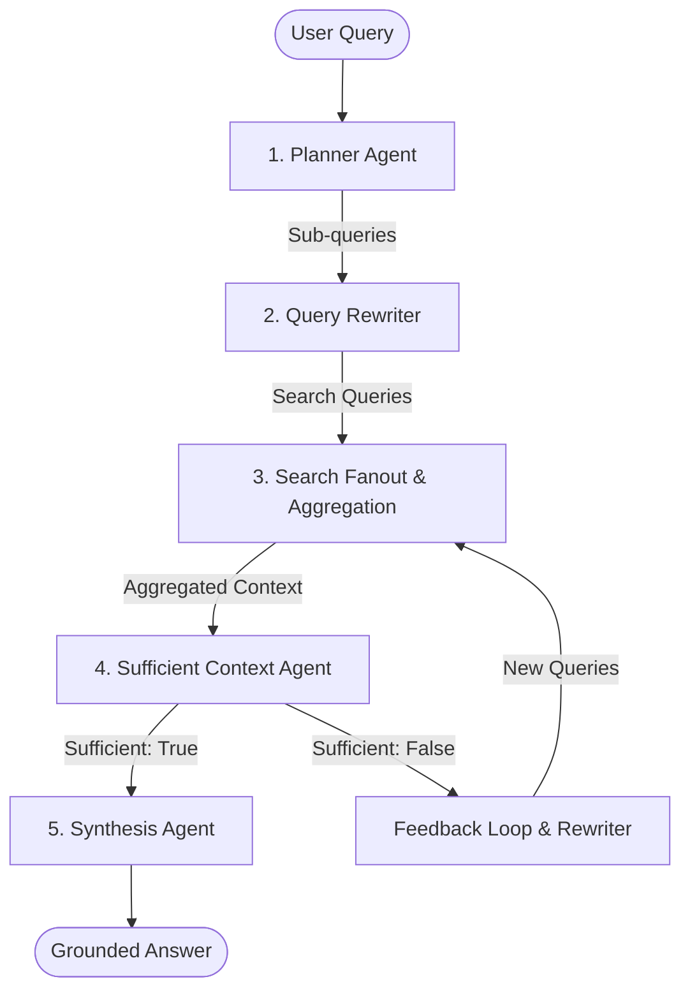

# Developer Notes & Demo Guide - Agentic RAG FastAPI (Version 3)

This guide documents the phases of the Agentic RAG system, lists the operational endpoints, and explains how to run an interactive vanilla vs. agentic retrieval demonstration.

---

## 1. The 5 Agentic RAG Phases

Our pipeline implements five sequential phases of agentic reasoning:



1. **Planner Agent**: Analyzes the user's input query and breaks it down into 2-5 simple, independent sub-questions representing different aspects of the topic.
2. **Query Rewriter**: Translates raw sub-questions into technical search queries optimized for semantic dense retrieval from a document repository.
3. **Search Fanout**: Retrieves context matching each rewritten sub-query concurrently, filters duplicates, aggregates contexts, and trims excess characters to respect context windows.
4. **Sufficient Context Agent**: Evaluates the retrieved context and a preliminary intermediate draft to decide if the material explicitly answers the user's specific details. If facts (like latency metrics, benchmark scores, exact numbers) are missing, it triggers the **Feedback Loop** with query rewrites.
5. **Synthesis Agent**: Receives verified, complete context and composes the final answer, ensuring zero hallucination.

---

## 2. API Endpoints Reference

### Core Endpoints
- `GET /health`: Basic health state check.
- `POST /upload-doc`: Uploads a PDF or DOCX file, assigns a unique `doc_id`, chunks text, builds embeddings, creates a FAISS index, and persists index & metadata entries to `registry.json`.

### Query Endpoints
- `POST /ask`: Primary agentic querying endpoint. Supports `include_trace: bool` (optional tracing) and `response_mode: "compact" | "detailed"`.
- `POST /vanilla-ask`: Standard retrieval baseline (retrieve -> synthesize) for quick quality comparisons.

### Document Management
- `GET /documents`: Lists all indexed documents in the system with their chunk and chunking settings.
- `GET /documents/{doc_id}`: Retrieves full metadata details of a single document by its ID.
- `DELETE /documents/{doc_id}`: Purges index files, pickle chunks, uploaded assets, registers, and memory caches.

### Inspection & Debugging
- `POST /ask-debug`: Fully detailed Agentic query execution that logs a timestamped run trace JSON file directly to `data/debug_runs/`.
- `POST /retrieve-only`: Returns raw retrieved chunks, similarity scores, and rewritten queries.
- `POST /plan`: Returns sub-queries from the Planner Agent.
- `POST /rewrite`: Returns rewritten retrieval queries.

---

## 3. How to Demo Vanilla RAG vs. Agentic RAG

### Step A: Start the Server
```bash
uvicorn app:app --reload
```
Open the interactive Swagger UI documentation at:
[http://127.0.0.1:8000/docs](http://127.0.0.1:8000/docs)

### Step B: Upload a Document
Upload a document (e.g. `google_agentic_rag.pdf` or another technical document) using the `/upload-doc` route. Take note of the returned `doc_id`.

---

## 4. Demonstration Test Queries

### Demo 1: The "Missing Information" Loop (Factual Metrics)
Use this query to demonstrate the strictness of the hardened Sufficient Context Agent:
- **Query**: `"What latency did Google report for the Sufficient Context Agent?"`
- **Expected Vanilla RAG Behavior**: Vanilla RAG will likely synthesize a generic or speculative response trying to explain latency or stating it has no information, without attempting retrieval expansion.
- **Expected Agentic RAG Behavior**: 
  - The Planner breaks it down into sub-queries.
  - The Sufficient Context Agent recognizes that the document does *not* explicitly contain exact latency figures.
  - It marks `context_sufficient = false`, registers the missing metrics, and provides specific feedback.
  - The feedback loop executes a second iteration of query rewriting and targeted search before concluding the synthesis.

### Demo 2: Complex Multi-part Architecture Query
Use this query to show query splitting and re-writing in action:
- **Query**: `"Explain Google's Agentic RAG architecture and the role of the Sufficient Context Agent."`
- **Expected Agentic RAG Behavior**: 
  - Planner splits this into two sub-questions: (1) details about the overall architecture, and (2) details on the Sufficient Context Agent.
  - The Query Rewriter rewrites both queries.
  - Search Fanout retrieves context for both concurrently.
  - The Sufficient Context Agent verifies that both parts of the question are explicitly answered by the retrieved context (`context_sufficient = true`).
  - The Synthesis Agent produces a beautifully structured answer covering both parts of the question.
